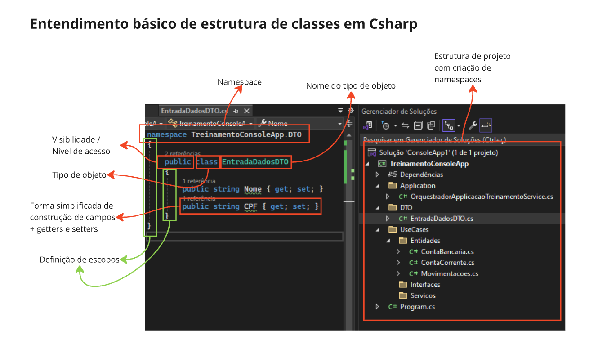
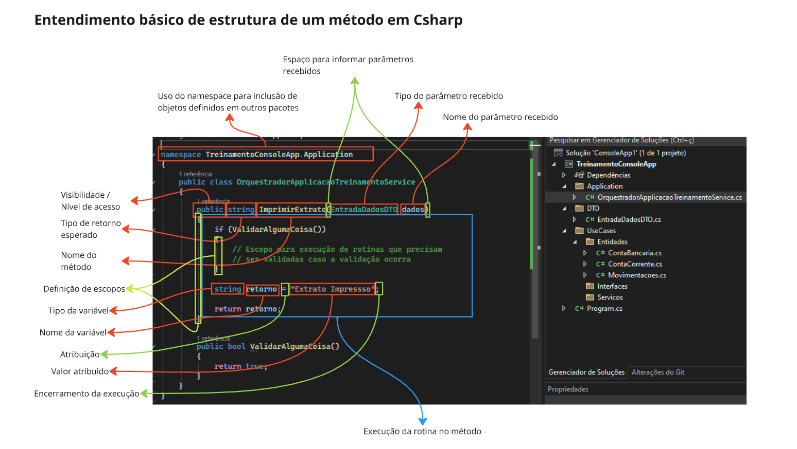
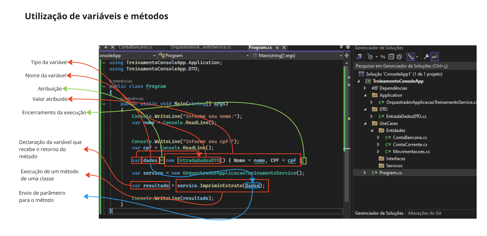

# Anatomia de objetos em C#

## Classe

 

- Namespace: Namespace é como se fosse o endereço do objeto, onde ele fica dentro do projeto.
- Nível de visibilidade e acesso: Serve para definir como a classe será visualizada por quem vem de fora, permitindo ou não e limitando o acesso.
- Tipo de objeto: Você sempre deve informar o tipo que esta criando, Class para classe, Interface para interface.
- Nome do tipo de objeto: Uma vez definido o tipo de objeto você deve informar o nome dele para que ele seja utilizado.
- Propriedades: propriedades em c# é uma forma simples de declara campos (atributos) provados e definir o nível de acesso a eles via métodos get e set, desta forma você não precisa criar toda a estrutura de declaração de campo, declaração de método get, declaração de método set. (Esta forma de uso é uma convenção no c#)
- Definição de escopos: Toda classe precisa definir um escopo, ou seja, um espaço de trabalho que delimite o que esta dentro e o que esta fora da execução da classe, assim como métodos, estruturas de comparação e iteração. No c# você define isto com {}
- Estrutura de projeto: No visual studio / vscode você tem uma parte chamada gerenciador de soluções ou explorer, que nada mais é do que a estrutura de pastas e / ou organização do projeto, onde você pode visualizar onde cada coisa fica, como o projeto esta organizado. Para além disto, no c#, quando você tem apenas a solution + projeto, e cria classes dentro do projeto, o namespace será sempre o nome do projeto, pois é o local onde a classe/arquivo "reside", quando você avança e cria uma estrutura de pastas para organizar camadas e responsabilidades, você cria novos espaços de endereço novos, dentro do endereço do projeto.

Pontos de observação:

Em c#, cada elemento é um arquivo. Ou seja, criei uma classe nova, logo ele deve ter um arquivo somente dele para resolver o problema desta classe, o mesmo para interfaces, classes abstratas, etc.

Por convenção, Nome de classes Inicia com letra maiúscula, Nome composto, inicial sempre maiúscula, siglas, prefixos ou sufixos mantém conforme definição dele ou padrão definido pela empresa / time.

Nome de métodos públicos, inicial maiúscula, nomes de métodos privados, inicial minuscula.
Nome de propriedades, inicial maiúscula.
Nome de campos (atributos), inicial minuscula (ou convenção da empresa para uso de underline no inicio)
Interface, sempre deve inicial com a letra "I" maiúscula, seguida da inicial maiúscula do nome da interface, isto vale para o nome do objeto e do arquivo.

## Método

- Uso do Namespace: Como já falado, namespaces são endereços de onde encontrar o objeto que precisaremos utilizar, no caso do exemplo, esta classe uma de suas dependências esta em outro espaço de endereço, logo precisamos informar para nossa classe que ela utilizara objetos que estejam no endereço desejado prefixado com a palavra using.
- Nível de visibilidade e acesso: Serve para definir como o método será visualizada por quem vem de fora, permitindo ou não e limitando o acesso. 
- Tipo de retorno do método: Você sempre deve informar o tipo de retorno do método, mesmo quando ele não retornará nada precisamos informar que o método é sem retorno.
- Nome do método: Uma vez definido o tipo de retorno do método você deve informar o nome dele para que ele seja utilizado.
- Espaço para receber parâmetros: Todo método pode ou não receber parâmetros, mas ele precisa ter um espaço definido e delimitado para isso, que no caso são parenteses.
- Tipo de parâmetro: Uma vez que o método receba parâmetros, você deve nesta ordem informar o tipo que será recebido.
- Nome do parâmetro: Depois de informar o tipo do parâmetro, você deve informar o nome para que ele seja utilizado.
- Definição de escopos: Assim como nas classe no método você precisa definir um escopo, ou seja, um espaço de trabalho que delimite o que esta dentro e o que esta fora da execução do método assim como suas estruturas de comparação e iteração. No c# você define isto com {}
- Declarando e utilizando variáveis:
    - Tipo: Você precisa definir o tipo da variável que irá utilizar;
    - Nome: Você precisa de um nome da variável para poder utilizar;
    - Esta variável receberá algum valor, ou seja, à esta variável você ira atribuir um valor, em c# a atribuição é feita utilizando o sinal de igual "="
    - Em c# para você informar que a instrução para esta execução acabou, você precisa encerrar ela, ou seja, informar para o compilador que "acabou", em c# você utiliza ponto e virgula ";"
- Retorno: Todo método que não é "void" define um tipo de retorno, para você encerrar a execução deste método, em todos os pontos de saída você deve informar um valor para ser retornado prefixando a palavra reservada "return"

## Utilização

 

### Variável

- Tipo da variável: Em c# temos a opção de utilizar var, porém var não define o tipo, mas ele infere que o tipo é relacionado com o tipo recebido, então neste caso, a declaração do tipo é a "soma" do var com o tipo recebido.
- Nome da variável: Você precisa de um nome da variável para poder utilizar;
- Esta variável receberá algum valor, ou seja, à esta variável você ira atribuir um valor, em c# a atribuição é feita utilizando o sinal de igual "="
- Em c# para você informar que a instrução para esta execução acabou, você precisa encerrar ela, ou seja, informar para o compilador que "acabou", em c# você utiliza ponto e virgula ";"

### Método

- Quando um método retorna algo, e temos a intenção de utilizar, podemos receber este retorno em uma variável.
- A execução de um método, diferente de uma variável onde é esperado uma atribuição, é feita com parenteses. Como dissemos acima, um método pode ou não receber parâmetros, então da mesma forma que o método espera definindo um tipo, nós enviamos o parâmetro deste tipo para ser utilizado. Mesmo quando o método não espera receber um parâmetro, precisamos enviar para ele um "não parâmetro", ou seja, abrir e fechar os parenteses.
- Por ultimo, caso o método em sua declaração exigir um parâmetro, precisamos enviar.

