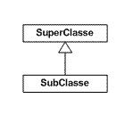
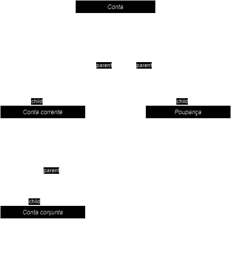

# Herança

A Herança possibilita que as classes compartilhem seus atributos, métodos e outros membros da classe entre si. 
Isto funciona de forma que a herança adota um relacionamento esquematizado hierarquicamente, como representado na imagem abaixo.

 

Na herança temos estes dois tipos de classe principais.

- **Classe base**: A classe que compartilha suas características com a outra classe.
- **Classe Derivada**: A classe que herda as características compartilhadas pela classe base.

No uso da **Herança** uma classe derivada geralmente é a implementação especifica de um caso mais genérico. Neste caso a classe derivada deve definir somente as características que a tornam única.

Vamos tentar exemplificar, uma classe de "conta bancária" tende a ser uma classe mais genérica, pois uma conta pode ser uma conta corrente, pode ser uma conta poupança, pode ser uma conta conjunta.

Nestes exemplo a classe conta teria apenas dados que seriam compartilhados, como a pessoa responsável, número da conta, etc.

A conta corrente teria o saldo inicial do mês, saldo final, movimentação diária com saldo diário.

A conta poupança teria o rendimento por data de deposito ou de aniversário.

A conta conjunta poderia ser uma conta corrente com mais de um titular.

Ficando mais ou menos assim:

 

Esta representação em código ficaria assim:

```csharp

public class Conta{
    public string Titular {get;set;}
    public string NumeroConta {get;set;}
}

public class ContaCorrente : Conta {
    public double SaldoInicial {get;set;}
    public double SaldoFinal {get;set;}

    public List<Movimentacao> RegistroMovimentacoes(){
        // Busca e retorna lista de movimentações
        return new List<Movimentacao>();
    }
}

public class Poupanca : Conta {
    public double SaldoAtual {get;set;}

    public List<Rendimento> RegistroRendimentos(){
        // Busca e retorna lista de rendimentos
        return new List<Rendimento>();
    }
}

public class ContaConjunta : ContaCorrente {
    public string SegundoTitular {get;set;}
}

```