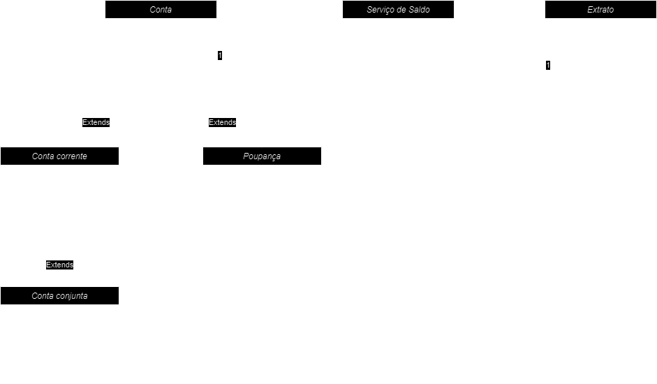

# Composição

Composição não é herança, mas também é um conceito de associação.

É muito comum a necessidade de compartilhar código que faz a mesma coisa entre classes espalhadas pela aplicação, e não é uma boa prática reescrever a função tantas vezes quando forem necessárias.

Herança resolve parte deste problema, pois você coloca os o código que tende a se repetir de forma genérica na classe base, também chamada de classe pai.

Porém quando falamos de herança estamos falando que a classe filha é um tipo da classe pai, ou seja, são uma coisa só.

Uma conta corrente é uma conta, uma poupança é um tipo de conta.

Agora vamos pensar no seguinte, a função de cálculo de saldo atual é compartilhado entre as classes que são conta.

Agora vamos pensar que esta função de calcular saldo também é utilizada em um serviço que representa um extrato. 
Não é correto afirmar que um extrato é uma conta, mas tanto as contas quanto o extrato fazem uso do mesmo código que calcula o saldo.

E agora??????

Neste caso usamos composição:

 

## Simplificando

Quando você tem um código genérico e a relação entre as duas classes significam que uma classe é do tipo da outra, então temos herança.
Agora quando a relação entre elas é de uma tem a outra, então a relação é de composição.

