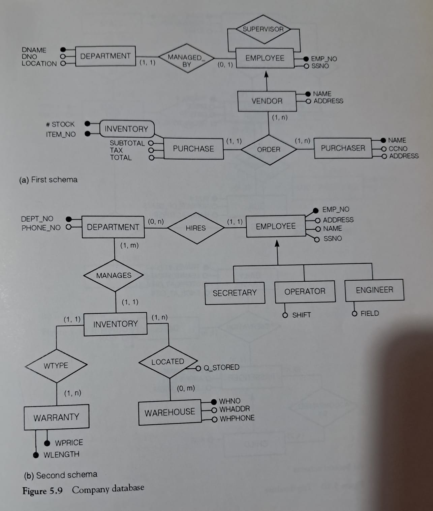
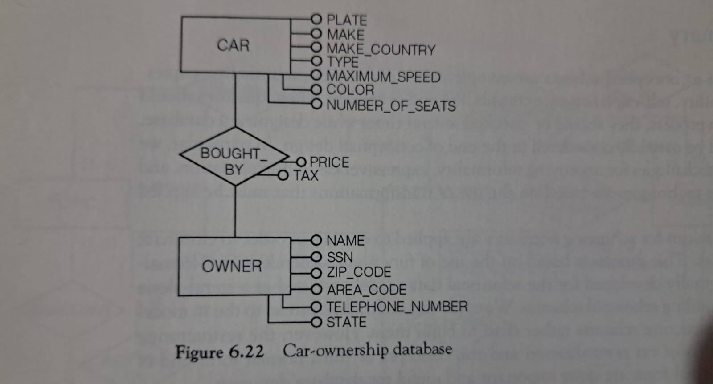

1. Considere as seguintes requisitos para a organização de um curso.

* Para cada participante do curso, guarde o primeiro nome, ultimo nome, data de nasciemento e sexo. 
* Indique se o participante é casado e quantos filhos tem. 
* Represente as cidades onde nasceram e onde moram, juntamente com os estados. 
* Guarde outras informações relacionados ao curso que eles frequentam (numero de aulas, data, conteudos), e o professor (ou professores) que lessionam o curso(primeiro nome, ultimo nome, afiliação).
* Para professores afiliados com universidades, indique sua afiliação e seu campo de especialização. 

Produza o esquema de banco de dados. 

2. Produza um esquema de banco de dados que inclua pelo menos:

* Cinco entidades, uma delas com uma chave composta;
* Cinco relações, com uma relação ternária;
* Uma hierarquia de generalização;

Quando você terminar, analize seu trabalho e indique quais estratégias você usou. Escreva uma descrição narrativa do esquema, como o fluxo ocorre etc. 

3. Integre os dois esquemas na figura 5.9 que representam as vendas em uma companhia e a estrutura de seus departamentos e funcionários, produzindo um unico esquema. pag 132.

4. Cheque a normalização do esquema da figura 6.22. Faça quaisquer suposições razoáveis ​​​​que você precisa fazer e justifique.

