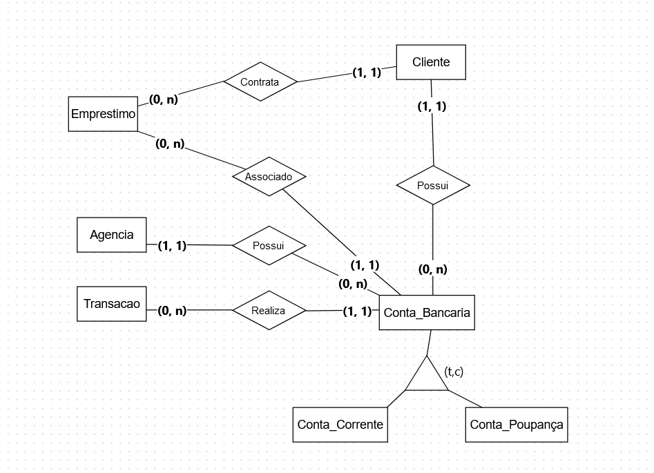
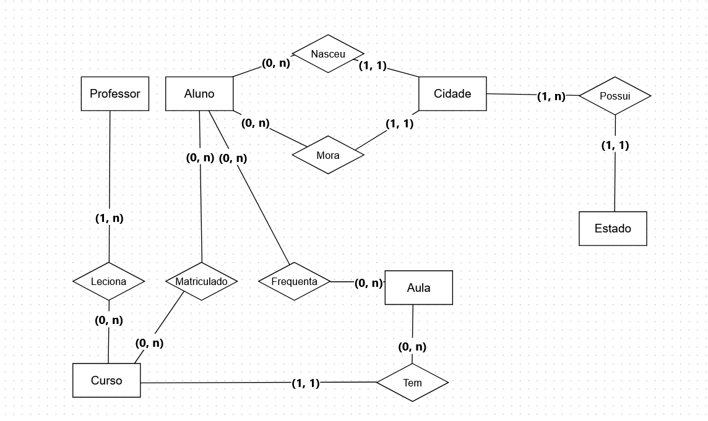

2. 
Possível solução de diagramação ER(faltou adicionar atributos): 



Esquema com atributos:
cliente:
id_cliente, nome, cpf, data_nascimento, endereço

```  
conta_bancaria:
numero_conta, id_cliente, tipo_conta(enum), saldo, data_abertura, id_agencia

		^ 
		| 
		| 

conta_corrente:   conta_poupança:
limite_especial   taxa_juros 
```

agencia:
codigo_agencia, nome, endereço

transacao:
id_transacao, numero_conta, tipo_transacao(enum), valor, data_transacao

cliente_emprestimo
id_emprestimo, id_cliente

emprestimo
id_emprestimo, valor_emprestimo, data_aprovacao, data_vencimento, numero_conta


1. 
Possível solução de diagramação ER (faltou adicionar os atributos):



Esquema com atributos:

Aluno:
aluno_id, primeiro_nome, ultimo_nome, data_nascimento, sexo, casado(boolean), 
numero_filhos , cidade_nascimento_id, cidade_residencia_id

cidade:
cidade_id, nome, estado_id

estado:
estadao_id, nome, sigla

curso:
curso_id, nome, numero_aulas 

curso_professor:
id_curso, id_professor

professor:
professor_id, primeiro_nome, ultimo_nome, afiliação?, campo_especialização?

aula:
aula_id, curso_id, data_aula, conteudo

inscrição_curso:
inscricao_id, participante_id, curso_id, periodo_inscricao


3. 